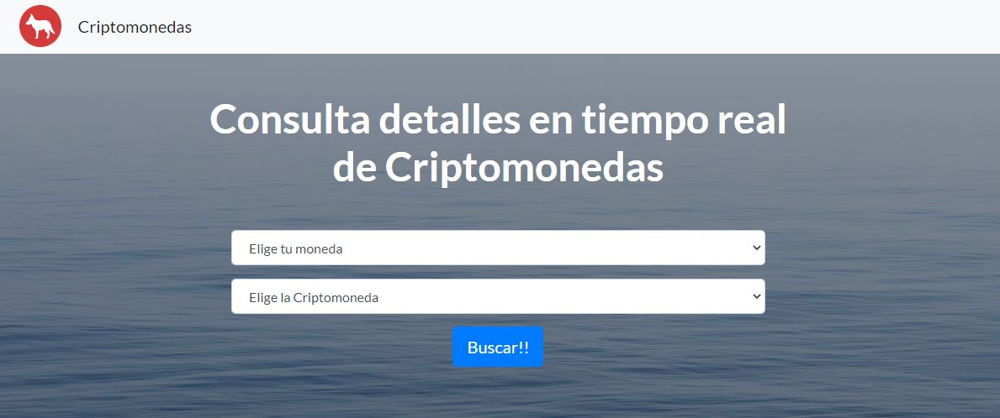
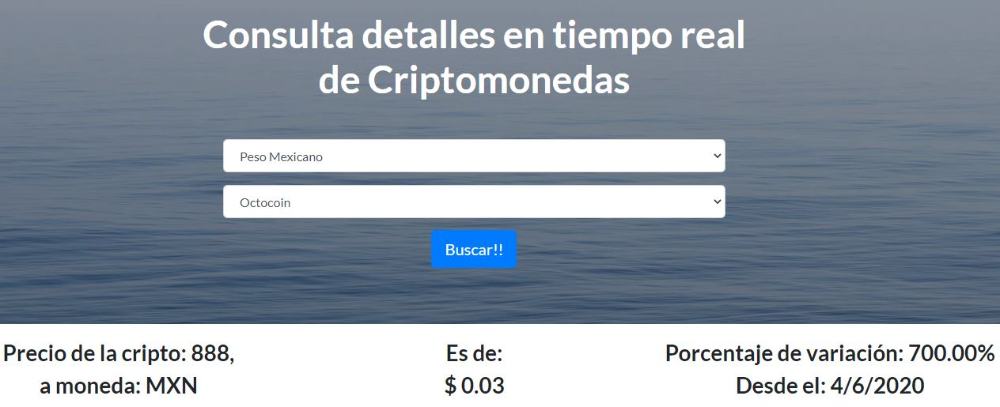
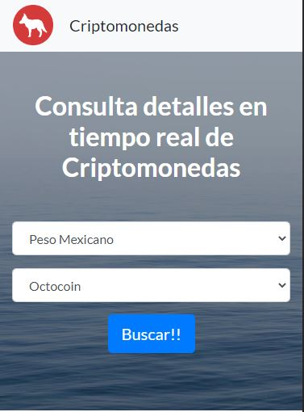

# Cripto-API
## Aplicación web, construida para consumir una REST API

  

La pagina web conecta con la API: min-api.cryptocompare.com, la cual brinda datos sobre diferentes tipos de criptomonedas.

  

La API, requiere de la autenticación mediante un token. La petición a la API nos arroja el nombre de la criptomoneda,
su precio, la fecha de actualización de la API y el porcentaje de cambio de la moneda.

  

